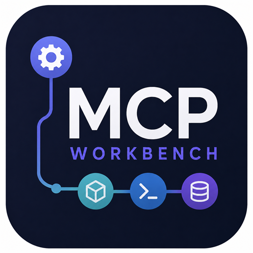
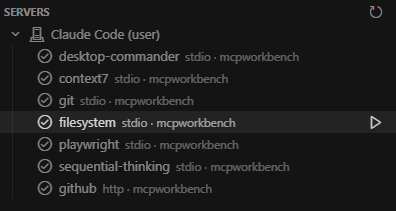
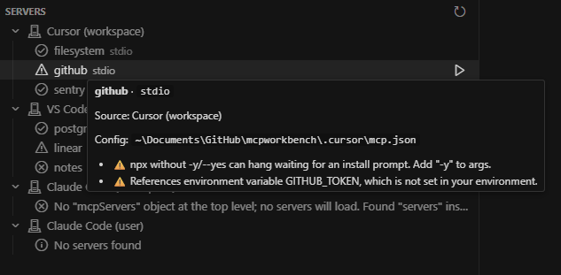

<p align="center">
  
</p>

# MCP Workbench

Discover, validate, and test every MCP server across Cursor, VS Code, and Claude — in one place.

MCP server definitions end up scattered across half a dozen files with different root keys and transport conventions, and a single typo silently drops a server with no warning. MCP Workbench scans every known location, normalizes the results into one tree, and flags the misconfigurations that usually cost you an hour of debugging.



## Features

- **Unified discovery** — one tree of every MCP server found across Cursor, VS Code, Claude Code, and Claude Desktop, grouped by source.
- **Transport normalization** — `stdio`, `http`, and `sse` servers shown with a consistent shape regardless of which editor's field conventions the file used.
- **Configuration validation** — surfaces the silent failures: wrong root key, unparseable JSON, `npx` without `-y`, and `${ENV}` references that aren't set in your environment.
- **Connection testing** — launch any server over the MCP SDK, run the `initialize` handshake, and list its capabilities and tools (with input schemas) — or see the exact reason it failed to connect.
- **Live tool calls** — fire a real `tools/call` from the panel with arguments pre-filled from each tool's schema, and see the result rendered inline.
- **Provenance at a glance** — every server shows which file and editor it came from, with the absolute config path one click away.
- **Live refresh** — re-scans automatically when any known MCP config changes in your workspace.

## Screenshots

Hover any server to see its source, the exact config file it came from, and every validation issue:



## Where it looks

| Source | Location | Root key |
| --- | --- | --- |
| Cursor (global) | `~/.cursor/mcp.json` | `mcpServers` |
| Cursor (workspace) | `<workspace>/.cursor/mcp.json` | `mcpServers` |
| VS Code (workspace) | `<workspace>/.vscode/mcp.json` | `servers` |
| Claude Code (workspace) | `<workspace>/.mcp.json` | `mcpServers` |
| Claude Code (user) | `~/.claude.json` | `mcpServers` |
| Claude Desktop | `~/.claude/claude_desktop_config.json` | `mcpServers` |

Servers recorded per project under `projects["<path>"].mcpServers` in `~/.claude.json` are scoped to the open workspace folder by default. Set `mcpWorkbench.showAllClaudeProjects` to list every recorded project. Edits to the global config files above refresh the tree automatically.

## Validation checks

| Issue | Level | What it catches |
| --- | --- | --- |
| `missing-root-key` | error | The right file with the wrong top-level key, so the editor loads no servers without warning. |
| `bad-json` | error | A config file that can't be parsed. |
| `unknown-transport` | error | An entry with neither a `command` (stdio) nor a `url` (http/sse). |
| `empty-root-key` | warning | The root key is present but defines no servers. |
| `npx-missing-y` | warning | `npx` without `-y`/`--yes`, which can hang waiting for an install prompt. |
| `env-unset` | warning | A `${VAR}` / `${env:VAR}` reference that isn't set in your environment. |
| `non-string-arg` / `non-string-value` | warning | A non-string arg, env value, or header that would otherwise be silently coerced. |

## Getting started

### Run from source

```bash
git clone https://github.com/wheelbarrel00/mcpworkbench.git
cd mcpworkbench
npm install
npm run compile
```

Open the folder in VS Code or Cursor and press **F5** to launch an Extension Development Host with MCP Workbench loaded. Click the **MCP Workbench** icon in the activity bar to open the **Servers** view.

### Install the packaged extension

```bash
npx @vscode/vsce package
cursor --install-extension mcp-workbench-wb00-0.2.1.vsix
```

Then reload Cursor and open the MCP Workbench panel from the activity bar.

## Usage

- **Refresh** — re-scan all locations from the view's title bar.
- **Open Config File** — right-click a server to jump to the exact file it came from.
- **Test Server** — click the ▶ button on a server (or right-click → Test Server) to connect over the MCP SDK and open a panel with the server's `initialize` info, capabilities, and tools — or the exact connection error. The panel stays connected while open: edit a tool's JSON arguments and click **Call tool** to run it live, then close the panel to disconnect.

## Roadmap

- Opt-in support for VS Code user-profile `mcp.json` paths.

## License

[MIT](LICENSE)
