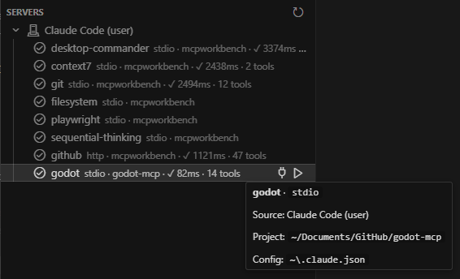
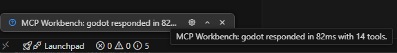
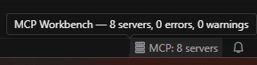
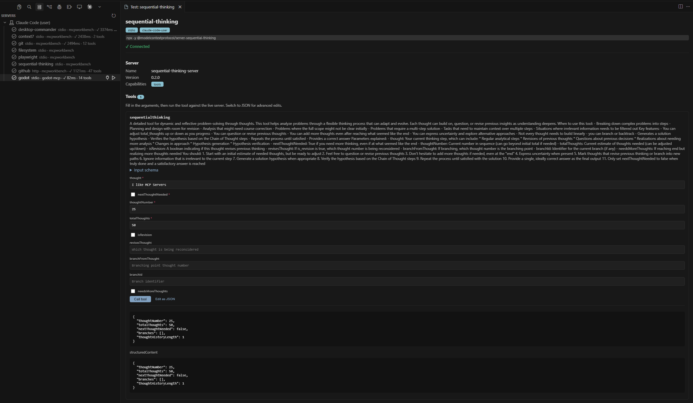
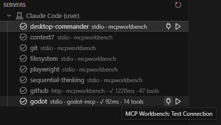

<p align="center">
  
</p>

# MCP Workbench

<p align="center">
  <a href="https://marketplace.visualstudio.com/items?itemName=wheelbarrel00.mcp-workbench-wb00"></a>
  <a href="https://open-vsx.org/extension/wheelbarrel00/mcp-workbench-wb00"></a>
  <a href="LICENSE"></a>
</p>

Discover, validate, and test every MCP server across Cursor, VS Code, and Claude — in one place.

MCP server definitions end up scattered across half a dozen files with different root keys and transport conventions, and a single typo silently drops a server with no warning. MCP Workbench scans every known location, normalizes the results into one tree, and flags the misconfigurations that usually cost you an hour of debugging.


## Features

- **Unified discovery** — one tree of every MCP server found across Cursor, VS Code, Claude Code, and Claude Desktop, grouped by source.
- **Transport normalization** — `stdio`, `http`, and `sse` servers shown with a consistent shape regardless of which editor's field conventions the file used.
- **Configuration validation** — surfaces the silent failures: wrong root key, unparseable JSON, `npx` without `-y`, and `${ENV}` references that aren't set in your environment.
- **Security & correctness checks** — flags hardcoded API keys, credentials in URLs, plaintext `http://` remotes, unpinned `npx`/`bunx` launchers, `curl | sh` bootstrap chains, and cloud-metadata endpoints, all from the config you already have.
- **Problems-panel diagnostics** — every issue is published as a native VS Code diagnostic anchored to the exact key in the config file, so it shows up as a squiggle and in the Problems panel with click-to-jump.
- **Connection testing** — launch any server over the MCP SDK, run the `initialize` handshake, and list its capabilities, tools, resources, and prompts (with input schemas) — or see the exact reason it failed to connect.
- **Per-server health** — a fast **Test Connection** records each server's handshake latency and tool count, shown inline in the tree, with a status-bar rollup of how many servers and issues were found across every source.
- **Live tool calls, resource reads, and prompt fetches** — call any tool through a form generated from its input schema, with required-field validation and a Form/JSON toggle for advanced edits; read any resource (or fill in a template URI); and fetch a prompt's messages with its arguments — all against the live server, rendered inline.
- **Provenance at a glance** — every server shows which file and editor it came from, with the absolute config path one click away.
- **Live refresh** — re-scans automatically when any known MCP config changes in your workspace.

## Screenshots

Hover any server to see its source, the exact config file it came from, and every validation issue:


### Per-server health

Run a fast **Test Connection** on any server to record its handshake latency and tool count, shown inline in the tree — with a status-bar rollup of every server and issue found:





### Status-bar rollup

An always-visible **MCP** item in the status bar rolls up every source at a glance — the total server count, plus a running tally of configuration and security issues. Hover for the full **N servers, X errors, Y warnings** breakdown, click to jump straight to the Servers view, and watch it turn yellow or red the moment a warning or error appears:



### Tool, resource & prompt tester

Open a server to call its tools through a form generated from each tool's input schema (or switch to raw JSON), read resources, and fetch prompts — live, with results rendered inline:



## Where it looks

| Source | Location | Root key |
| --- | --- | --- |
| Cursor (global) | `~/.cursor/mcp.json` | `mcpServers` |
| Cursor (workspace) | `<workspace>/.cursor/mcp.json` | `mcpServers` |
| VS Code (workspace) | `<workspace>/.vscode/mcp.json` | `servers` |
| Claude Code (workspace) | `<workspace>/.mcp.json` | `mcpServers` |
| Claude Code (user) | `~/.claude.json` | `mcpServers` |
| Claude Desktop | `~/.claude/claude_desktop_config.json` | `mcpServers` |

Servers recorded per project under `projects["<path>"].mcpServers` in `~/.claude.json` are scoped to the open workspace folder by default. Set `mcpWorkbench.showAllClaudeProjects` to list every recorded project. Edits to the global config files above refresh the tree automatically.

## Validation checks

Every issue below is also published to the Problems panel, anchored to the exact key it concerns.

### Configuration

| Issue | Level | What it catches |
| --- | --- | --- |
| `missing-root-key` | error | The right file with the wrong top-level key, so the editor loads no servers without warning. |
| `bad-json` | error | A config file that can't be parsed. |
| `unknown-transport` | error | An entry with neither a `command` (stdio) nor a `url` (http/sse). |
| `empty-command` | error | An stdio server whose `command` is blank. |
| `empty-root-key` | warning | The root key is present but defines no servers. |
| `npx-missing-y` | warning | `npx` without `-y`/`--yes`, which can hang waiting for an install prompt. |
| `env-unset` | warning | A `${VAR}` / `${env:VAR}` reference that isn't set in your environment. |
| `non-string-arg` / `non-string-value` | warning | A non-string arg, env value, or header that would otherwise be silently coerced. |

### Security

| Issue | Level | What it catches |
| --- | --- | --- |
| `hardcoded-secret` | warning | A literal API key or private key in an arg, env value, or header (OpenAI, Anthropic, GitHub, Slack, AWS, PEM). Use a `${VAR}` reference instead. |
| `credential-in-url` | warning | Credentials in the URL's userinfo or a `token`/`secret`/`key`-style query parameter, where they leak into logs. |
| `insecure-remote-transport` | warning | A plaintext `http://` URL to a non-local host, so traffic and credentials travel unencrypted. |
| `risky-shell-pipe` | warning | An argument that pipes a downloaded script straight into a shell (`curl … \| sh`), running remote code at launch. |
| `encoded-powershell` | warning | PowerShell invoked with an encoded command (`-enc`), which hides what actually runs. |
| `metadata-endpoint` | warning | A URL pointing at the cloud metadata address (`169.254.169.254`), a common SSRF target. |
| `unpinned-launcher` | info | `npx`/`bunx`/`pnpm dlx`/`yarn dlx`/`npm exec` running a package with no version pin, so a future release could change behavior. |

Turn the whole security lens off with `mcpWorkbench.security.enabled: false`, or retune individual rules with `mcpWorkbench.security.ruleSeverity` — e.g. `{ "unpinned-launcher": "off", "hardcoded-secret": "error" }` (values: `off`, `info`, `warning`, `error`).

## Install

- **VS Code** — open the Extensions view and search **"MCP Workbench: Discover & Test"**, or [install from the Marketplace](https://marketplace.visualstudio.com/items?itemName=wheelbarrel00.mcp-workbench-wb00).
- **Cursor** — open Extensions and search **"MCP Workbench"** (Cursor installs from Open VSX), or [install from Open VSX](https://open-vsx.org/extension/wheelbarrel00/mcp-workbench-wb00).

Then click the **MCP Workbench** icon in the activity bar to open the **Servers** view.

### Build from source

```bash
git clone https://github.com/wheelbarrel00/mcpworkbench.git
cd mcpworkbench
npm install
npm run compile
```

Press **F5** to launch an Extension Development Host with MCP Workbench loaded, or run `npm run package` to build a `.vsix` you can install with `--install-extension`.

## Usage

- **Refresh** — re-scan all locations from the view's title bar.
- **Open Config File** — right-click a server to jump to the exact file it came from.
- **Test Connection** — click the plug button on a server (or right-click → Test Connection) for a fast health check: it connects, times the handshake, and counts the tools without opening the full panel. The latency and tool count are cached and shown inline in the tree, and a rollup of every server and issue stays in the status bar.

  

- **Test Server** — click the ▶ button on a server (or right-click → Test Server) to connect over the MCP SDK and open a panel with the server's `initialize` info, capabilities, tools, resources, and prompts — or the exact connection error. The panel stays connected while open: call a tool through a form generated from its schema (or switch to raw JSON), **Read** a resource (filling in any template variables), or **Get prompt** with its arguments to run against the live server, then close the panel to disconnect.

## Roadmap

- Opt-in support for VS Code user-profile `mcp.json` paths.

## License

[MIT](LICENSE)
